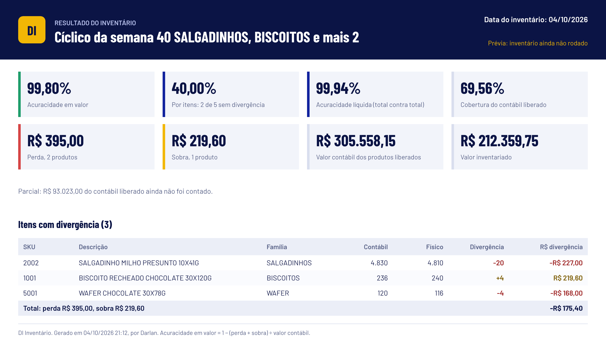
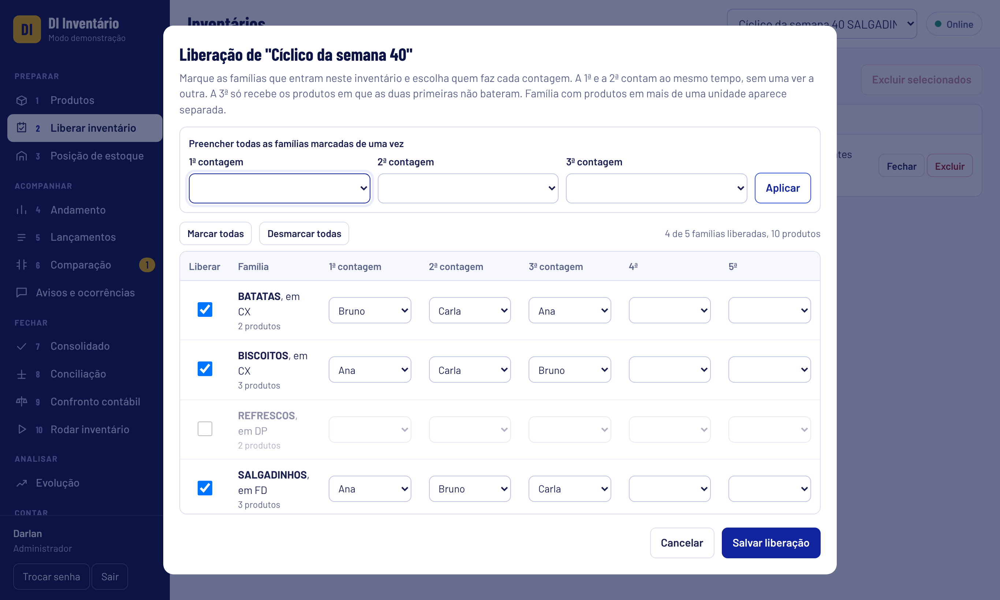
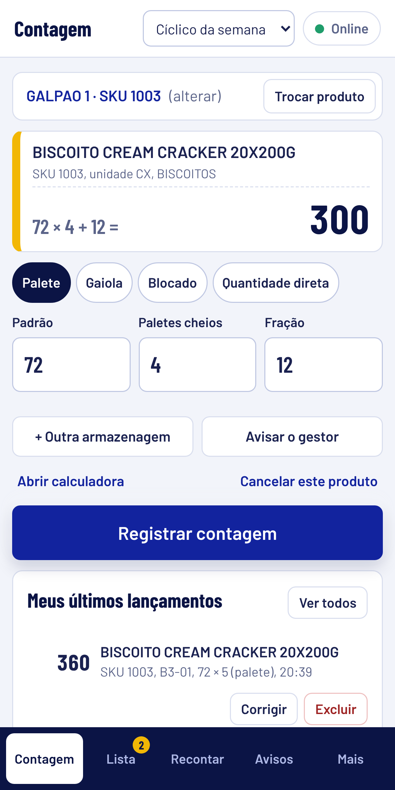
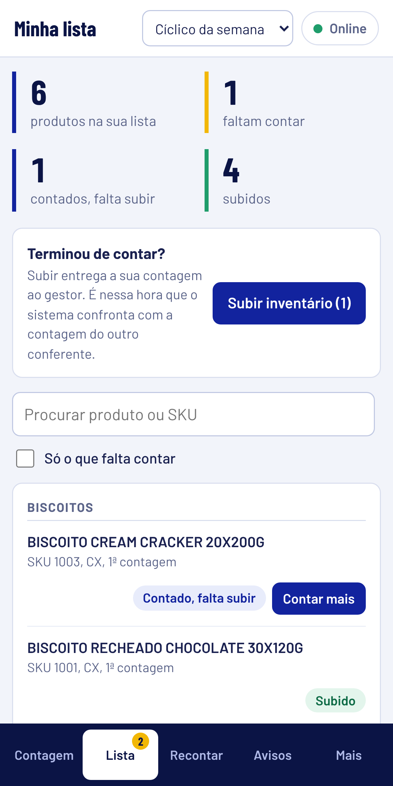
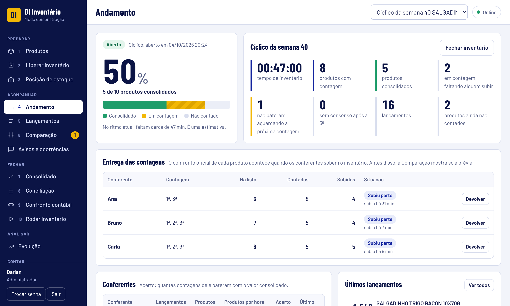
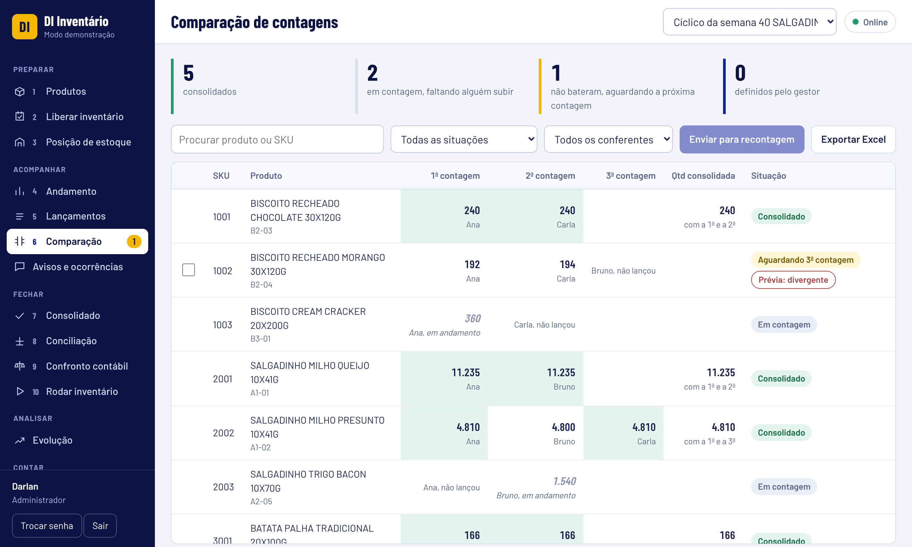
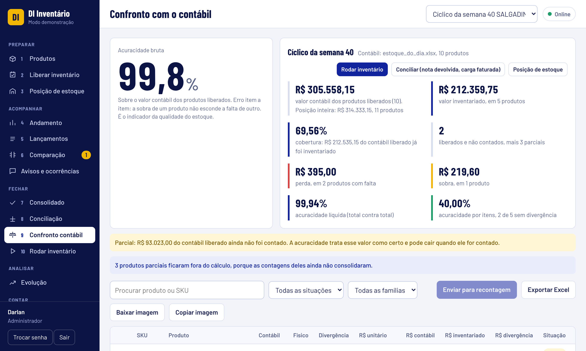
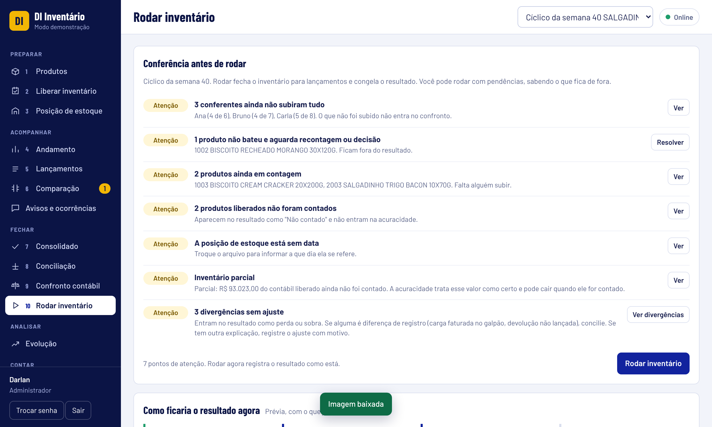

# DI Inventário

Sistema web de inventário de estoque com **contagem cega**, **comparação entre contagens** e **confronto com o saldo contábil**. Roda no celular do conferente e no computador do gestor, em tempo real.

**Demonstração:** https://darlanalves-dados.github.io/di-inventario/

Abra o link, escolha um usuário de teste e use à vontade. Na demonstração os dados são fictícios e ficam só no seu navegador.

## O problema

Contagem cega já é regra em um bom inventário cíclico. O que ainda consome tempo é o que vem depois dela:

1. Comparar a 1ª e a 2ª contagem, produto por produto, para achar o que divergiu.
2. Decidir quem reconta e acompanhar se a recontagem voltou.
3. Confrontar com o saldo do sistema e só então chegar à acuracidade.
4. Descobrir se a divergência de hoje é a mesma do inventário passado.

O DI Inventário tira esse trabalho da planilha.

## Como funciona

| Etapa | O que acontece |
| --- | --- |
| 1. Liberar | O gestor escolhe as famílias e quem faz a 1ª e a 2ª contagem de cada uma. |
| 2. Contar | Cada conferente recebe a sua lista no celular e conta sem ver o saldo do sistema nem a contagem do colega. |
| 3. Comparar | Quando duas contagens do mesmo produto batem, o número vale. Se não batem, o produto vai para uma terceira pessoa. |
| 4. Confrontar | O consolidado é comparado com a posição de estoque e gera perda, sobra e acuracidade em valor. |
| 5. Rodar | O resultado é congelado, com relatório em Excel e imagem pronta para o e-mail. |
| 6. Analisar | A evolução mostra a acuracidade por inventário e por família, e quais produtos mantêm divergência. |

## Telas

**Liberação por família e por contagem**

**Contagem no celular**

 

**Andamento em tempo real**

**Comparação de contagens**

**Confronto com o contábil**

**Conferência antes de rodar**

## Principais recursos

- Contagem cega: o conferente não vê saldo, valor nem a contagem de outra pessoa. A regra está no banco, não só na tela.
- Contagem por palete, gaiola, blocado ou quantidade direta, com o cálculo feito pelo sistema.
- Leitura de código de barras por leitor de mão ou pela câmera.
- Comparação pelo total do produto, da 1ª à 5ª contagem, e contagem única com recontagem escolhida pelo gestor.
- Conciliação de diferenças de registro (carga faturada no galpão, devolução não lançada), com justificativa.
- Posição de estoque inicial e final, para apontar o que movimentou durante a contagem.
- Acuracidade em valor, líquida e por itens, sobre o contábil das famílias inventariadas.
- Avisos e ocorrências entre gestor e conferente, ligados ao inventário e ao produto.
- Histórico do produto e tabela de divergência por produto, com a tendência de cada SKU.
- Relatório de fechamento em Excel e imagem do resultado.
- Três perfis: administrador, gestor e conferente.
- Funciona como aplicativo no celular (instalável pela tela inicial).

## Tecnologia

- **Front-end:** HTML, CSS e JavaScript puro, em um único arquivo. Sem framework.
- **Banco e login:** Supabase (PostgreSQL), com segurança por linha (RLS) e atualização em tempo real.
- **Hospedagem:** arquivos estáticos (Cloudflare ou GitHub Pages).
- **Testes:** regras de negócio em Node, fluxos de tela automatizados com Playwright e permissões do banco em PostgreSQL local.

Este repositório traz a versão de demonstração, que não se conecta a nenhum banco. O código é publicado compactado: serve para rodar a demonstração, não para reuso. A pasta `exemplos` tem uma tabela de produtos e uma posição de estoque fictícias para importar e testar.

## Como testar a demonstração

1. Abra o link da demonstração.
2. Entre como **Darlan (Administrador)** para ver a gestão, ou como **Ana**, **Bruno** ou **Carla** para ver a tela do conferente.
3. Para ver o tempo real, abra duas abas: uma como gestor e outra como conferente.

## Sobre o projeto

Criado por **Darlan Alves**, profissional de logística e dados, como um **projeto pessoal de estudo, desenvolvimento e demonstração**.

O DI Inventário foi desenvolvido de forma independente, com base na experiência do autor em processos de estoque e inventário, utilizando **dados fictícios** e regras de negócio estruturadas pelo próprio autor.

O projeto **não representa, reproduz ou utiliza dados, sistemas, código-fonte, bases de dados, credenciais ou informações confidenciais de qualquer empregador**.

As regras de negócio, os testes de uso e a validação do sistema são de autoria do autor.

- LinkedIn: https://www.linkedin.com/in/darlan-alves-logistica-dados
- GitHub: https://github.com/darlanalves-dados
